Suite à l'arrestation des fondateurs de Samourai Wallet et à la saisie de leurs serveurs le 24 avril dernier, certaines fonctionnalités de l'application sont désormais inopérantes, et les utilisateurs qui ne disposent pas de leur propre Dojo ne peuvent plus diffuser de transactions.

Après avoir assisté plusieurs utilisateurs dans la récupération de leurs bitcoins durant ces derniers jours, je pense avoir rencontré la plupart des problèmes susceptibles de se présenter lors de la restauration d'un portefeuille Samourai. Ce tutoriel débutera donc par un état des lieux pour identifier les fonctionnalités qui restent opérationnelles et celles qui ne le sont plus au sein de l'écosystème de Samourai Wallet et des logiciels affectés par cette affaire. Ensuite, nous procéderons étape par étape à la récupération d'un portefeuille Samourai en utilisant les logiciels Sparrow Wallet et Electrum. Nous examinerons tous les obstacles potentiels rencontrés durant ce processus et verrons les solutions pour les résoudre. Enfin, dans la dernière partie, vous découvrirez les potentiels risques existants pour votre confidentialité suite à la saisie des serveurs.

*Un grand merci à [@Louferlou](https://twitter.com/Louferlou), qui a assisté plusieurs utilisateurs dans leur récupération et partagé ses expériences avec moi, et qui a également contribué aux tests pour déterminer ce qui est encore fonctionnel.*

## Est-ce que Samourai Wallet fonctionne encore ?

Oui, **l'application Samourai Wallet fonctionne toujours**, mais avec certaines conditions.

Premièrement, il est nécessaire que l'application ait été préalablement installée sur votre smartphone. Le Google Play Store a supprimé l'application et l'APK était hébergée sur le site web saisi. Il est donc compliqué d'installer Samourai pour le moment. Vous trouverez sûrement des APK en ligne, mais je vous conseille de ne pas les télécharger à moins d'être sûr de la source.

Étant donné que la page de Samourai Wallet n'est plus disponible ni sur le Google Play Store ni sur F-Droid, il n'est pas possible de désactiver les mises à jour automatiques. Si l'application revient sur ces plateformes, il serait prudent de **désactiver les mises à jour automatiques** jusqu'à ce que davantage d'informations soient disponibles concernant l'évolution de l'affaire.

Si Samourai Wallet est déjà installé sur votre smartphone, vous devriez toujours pouvoir accéder à l'application. Pour utiliser la fonctionnalité wallet de Samourai, il est indispensable de connecter un Dojo. Auparavant, les utilisateurs sans Dojo personnel dépendaient des serveurs de Samourai pour accéder aux informations de la blockchain Bitcoin et pour diffuser des transactions. Avec la saisie de ces serveurs, l'application ne peut plus accéder à ces données.

Si vous n'aviez pas de Dojo connecté auparavant mais que vous en avez un maintenant, vous pouvez le configurer pour utiliser à nouveau votre application Samourai. Cela implique de vérifier vos sauvegardes, de supprimer le portefeuille (le wallet, pas l'application) et de récupérer le wallet en connectant votre Dojo sur l'application. Pour plus de détails sur ces étapes, vous pouvez consulter [ce tutoriel, dans la section "_Préparer son portefeuille Samourai Wallet_" : COINJOIN - DOJO](https://planb.network/fr/tutorials/privacy/coinjoin-dojo).

Si votre application Samourai était déjà connectée à votre propre Dojo, alors toute la partie wallet fonctionne parfaitement pour vous. Vous pouvez toujours voir votre solde et diffuser des transactions. Et malgré tout ce qu'il se passe, je pense que Samourai Wallet reste le meilleur logiciel de portefeuille mobile à l'heure actuelle. Personnellement, je compte bien continuer de l'utiliser. 

Le principal problème que vous pourriez rencontrer est l'inaccessibilité des comptes Whirlpool depuis l'application. Habituellement, Samourai tente d'établir une connexion avec votre Whirlpool CLI et de lancer les cycles de coinjoins avant de vous donner accès à ces comptes. Cependant, étant donné que cette connexion n'est plus possible, l'application peut continuer à chercher sans fin sans jamais vous donner accès aux comptes Whirlpool. Dans ce cas, vous pouvez récupérer ces comptes sur un autre logiciel de portefeuille tout en conservant uniquement le compte de dépôt sur Samourai.

### Quels sont les outils encore disponibles sur Samourai ?

En revanche, certains outils sont soit affectés par l'arrêt des serveurs, soit carrément indisponibles.

En ce qui concerne les outils de dépense individuels, tout fonctionne normalement à condition, bien sûr, que vous ayez votre propre Dojo. Les transactions Stonewall normales (et non les Stonewall x2) fonctionnent sans problème.

Des commentaires sur Twitter ont souligné que la confidentialité offerte par une transaction Stonewall pourrait désormais être réduite. La valeur ajoutée d'une transaction Stonewall réside dans le fait qu'elle est indistinguable d'une transaction Stonewall x2 en termes de structure. Lorsqu'un analyste rencontre ce pattern spécifique, il ne peut pas déterminer s'il s'agit d'un Stonewall standard avec un seul utilisateur ou d'un Stonewall x2 impliquant deux utilisateurs. Cependant, comme nous le verrons dans les paragraphes suivants, réaliser des transactions Stonewall x2 est devenu plus complexe en raison de l'indisponibilité de Soroban. Certains pensent donc qu'un analyste pourrait maintenant supposer que toute transaction avec cette structure est un Stonewall normal. Personnellement, je ne partage pas cette hypothèse. Bien que les transactions Stonewall x2 soient peut-être moins fréquentes (et je pense qu'elles l'étaient déjà avant cet incident), le fait qu'elles soient toujours possibles peut invalider toute une analyse basée sur l'assomption qu'elles ne le sont pas.

**[-> En savoir plus sur les transactions Stonewall.](https://planb.network/tutorials/privacy/stonewall)**

Pour ce qui est de Ricochet, je n'ai pas pu vérifier si le service était encore opérationnel, faute de posséder un Dojo sur le Testnet, et je préfère ne pas risquer de dépenser `100 000 sats` vers un portefeuille qui pourrait être contrôlé par les autorités. Si vous avez eu l'occasion de tester cet outil récemment, je vous invite à me contacter afin que nous puissions mettre à jour cet article.

Si vous avez besoin d'utiliser Ricochet, sachez que vous pouvez toujours réaliser cette opération manuellement avec n'importe quel logiciel de portefeuille. Pour apprendre comment effectuer manuellement les différents hops proprement, je vous recommande de consulter cet autre article : [**RICOCHET**](https://planb.network/tutorials/privacy/ricochet).

L'outil JoinBot n'est plus opérationnel, car il dépendait entièrement de la participation d'un portefeuille géré par Samourai.

Concernant les autres types de transactions collaboratives, souvent désignées sous le terme de "cahoots", elles restent possibles mais uniquement de manière manuelle. Avant l'arrêt des serveurs, vous aviez deux options pour réaliser des transactions Stonewall x2 ou Stowaway (PayJoin) : 
- utiliser le réseau Soroban pour échanger automatiquement et à distance les PSBT ;
- ou effectuer ces échanges manuellement en scannant plusieurs QR codes. 

Après plusieurs tests, il semble que Soroban ne fonctionne plus. Pour réaliser ces transactions collaboratives, l'échange des données doit donc se faire manuellement. Voici deux options pour effectuer cet échange :
- Si vous êtes physiquement proche de votre collaborateur, vous pouvez scanner les QR codes successivement ;
- Si vous êtes éloigné de votre collaborateur, vous pouvez échanger les PSBT via un canal de communication externe à l'application. Toutefois, faites attention, car les données contenues dans ces PSBT sont sensibles en termes de confidentialité. Je vous recommande d'utiliser un service de messagerie chiffrée pour assurer la confidentialité de l'échange.

**[-> En savoir plus sur les transactions Stonewall x2.](https://planb.network/tutorials/privacy/stonewall-x2)**

**[-> En savoir plus sur les transactions Stowaway.](https://planb.network/tutorials/privacy/payjoin-samourai-wallet)**

Pour ce qui est de Whirlpool, le protocole ne semble plus fonctionner, même pour les utilisateurs qui disposent de leur propre Dojo. J'ai surveillé mon RoninDojo ces derniers jours et effectué quelques tentatives de manipulations basiques, mais le Whirlpool CLI ne parvient pas à se connecter depuis l'arrêt des serveurs.

Toutefois, je garde espoir que ce protocole puisse être réactivé ou peut-être repensé différemment dans les semaines à venir, selon l'évolution de l'affaire. Cette pause pourrait être l'occasion pour explorer de nouvelles approches ou améliorations potentielles à ce système.

### Quels sont les outils externes encore disponibles ?

Au niveau des autres outils en lien avec l'environnement de Samourai, certains sont encore disponibles et d'autres ne le sont plus.

Le site gratuit d'analyse de chaîne OXT.me n'est hélas plus disponible pour le moment.

L'outil Whirlpool Stats Tool n'est plus disponible au téléchargement, car il était hébergé sur le GitLab de Samourai. Même si vous aviez préalablement téléchargé cet outil Python localement sur votre machine, ou s'il était installé sur votre nœud RoninDojo, WST ne fonctionnera plus pour le moment. En effet, il dépendait des données fournies par OXT.me pour son fonctionnement, et ce site n'est plus accessible. Actuellement, WST n'est pas particulièrement utile puisque le protocole Whirlpool est inactif.

Le site KYCP.org n'est actuellement plus accessible.

Le GitLab qui hébergeait le code de l'outil Python Boltzmann Calculator a aussi été saisi. À l'heure actuelle, il n'est donc plus possible de télécharger cet outil. Mais si vous disposez d'un RoninDojo, vous pouvez continuer à utiliser Boltzmann Calculator de la même manière qu'auparavant.

Pour ce qui est de RoninDojo, ce logiciel de node-in-box continue de fonctionner correctement malgré l'indisponibilité de certains outils spécifiques tels que Whirlpool CLI et WST. Si vous désirez obtenir davantage d'informations sur RoninDojo ou si vous avez des questions spécifiques, je vous encourage à rejoindre [leur groupe Telegram](https://t.me/RoninDojoNode).

Cependant, le code source de RoninDojo n'est actuellement plus accessible, car il était hébergé sur le GitLab de Samourai. Il n'est donc pas possible pour le moment de l'installer manuellement sur un Raspberry Pi.

En ce qui concerne le logiciel de portefeuille watch-only Sentinel, la situation est similaire à celle de l'application Samourai. Si vous disposez de votre propre Dojo, vous pouvez continuer à utiliser Sentinel sans aucun problème. Cependant, si vous n'avez pas de Dojo, vous ne serez plus en mesure d'établir une connexion. Contrairement à Samourai, le site web de Sentinel est toujours accessible en ligne. Mais soyez prudent avec ce site et l'APK qui y est proposée, car on ne sait pas qui contrôle actuellement ces ressources.

### Est-ce que Sparrow Wallet est affecté ?

Sparrow Wallet fonctionne toujours de manière normale, à l'exception des outils de Samourai qui ne sont plus disponibles. Actuellement, il n'est plus possible d'effectuer des coinjoins via Sparrow. De même, les outils de dépense collaboratifs ne sont plus accessibles, car Sparrow ne propose pas l'option d'échange manuel des PSBT, contrairement à Samourai. Pour toutes les autres fonctionnalités, Sparrow fonctionne sans problème. Vous pouvez d'ailleurs utiliser ce logiciel pour récupérer un portefeuille Samourai si nécessaire.

## Comment récupérer un portefeuille Samourai ?

Comme nous l'avons vu dans les sections précédentes, si vous possédez votre propre Dojo, il n'est pas forcément nécessaire de changer de logiciel. **Samourai reste un excellent choix de portefeuille chaud** pour vos dépenses quotidiennes. Toutefois, si vous n'avez pas de Dojo ou si vous préférez opter pour un autre logiciel, je vous explique le processus de récupération complet, en détaillant les éventuels blocages que vous pourriez rencontrer.

Dans tous les cas, il est important de prendre votre temps et de veiller à ne pas commettre d'erreur. Rappelez-vous qu'il n'y a pas d'urgence car vous détenez vos clés privées, et la saisie des serveurs de Samourai n'affecte en rien cela. Quoi qu'il arrive, ils ne pourront évidemment pas accéder à vos clés privées.

### Vérifier la passphrase

Pour récupérer votre portefeuille, vous devez obligatoirement disposer de votre passphrase, même si vous optez pour une récupération via le fichier de sauvegarde. Commencez par vérifier la validité de cette passphrase. Ouvrez votre application Samourai Wallet, cliquez sur l'icône de votre Paynym en haut à gauche, puis sélectionnez `Paramètres`.

Ensuite, cliquez sur `Dépannage` puis sur `Passphrase/test sauvegarde`.

Saisissez votre passphrase et cliquez sur `Ok`. Si elle est correcte, Samourai vous le confirmera. Vous avez aussi la possibilité de vérifier le fichier de sauvegarde si vous envisagez de l'utiliser ultérieurement.

Cette étape est facultative mais recommandée. Elle permet de confirmer que la passphrase est correcte, ce qui élimine une source potentielle de problèmes ultérieurs. Si Samourai indique que la passphrase est incorrecte à cette étape, la récupération ne pourra pas se faire. Assurez-vous d'avoir saisi correctement la passphrase et vérifiez-la à nouveau.

### Option 1 : Récupérer le portefeuille sur Sparrow avec le fichier de sauvegarde

Depuis la version 1.8.6 de Sparrow Wallet, il est possible d'importer directement votre portefeuille Samourai à l'aide du fichier texte de sauvegarde nommé `samourai.txt`, que votre application Samourai Wallet génère automatiquement. Ce fichier contient toutes les informations nécessaires pour récupérer votre portefeuille et est chiffré avec votre passphrase pour en assurer la sécurité.

Si vous choisissez cette option, vous aurez besoin de votre fichier `samourai.txt` à jour et de votre passphrase. Pour générer ce fichier sur Samourai Wallet, cliquez sur les trois petits points en haut à droite, puis sélectionnez `Exporter sauvegarde portefeuille`.

Ensuite, choisissez `Exporter vers le presse-papiers`. Après cela, vous allez devoir transmettre ce fichier sur votre PC de manière sécurisée. Étant donné que le fichier est chiffré mais que la passphrase suffit pour le déchiffrer, il est important de prendre des précautions lors de sa transmission. Si vous optez pour un transfert direct sous forme de texte brut, vous devrez recréer un fichier `samourai.txt` sur votre PC et y coller le contenu du presse-papiers. Une alternative serait de récupérer directement le fichier `samourai.txt` depuis les fichiers stockés sur votre téléphone.

Une fois que vous avez accès au fichier sur votre PC, ouvrez Sparrow Wallet, cliquez sur l'onglet `File` et sélectionnez `Import Wallet` pour commencer l'importation de votre portefeuille.

Descendez jusqu'à `Samourai Backup`, cliquez sur `Import File` puis sélectionnez votre fichier `samourai.txt`.

Sparrow vous demandera ensuite un mot de passe pour déchiffrer le fichier. Ce mot de passe est en fait votre passphrase. Saisissez-la dans le champ correspondant et cliquez sur `Import`.

Si à ce stade, votre portefeuille n’apparaît pas, il est possible que vous ayez commis une erreur lors de la copie du fichier `samourai.txt` ou lors de la saisie de la passphrase. Vous pouvez consulter la section dédiée à la résolution des problèmes pour plus d'aide.

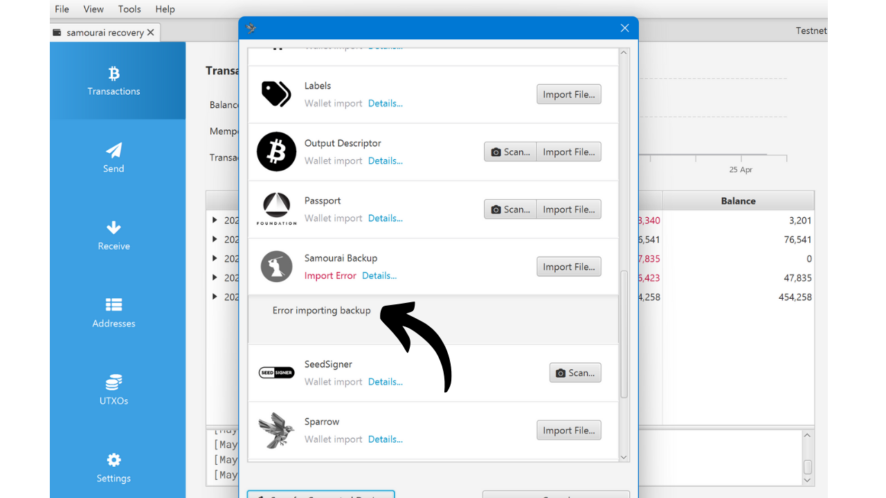

Pour le type de script, si vous n'avez pas configuré d'autres scripts dans Samourai, vous devriez normalement utiliser uniquement du SegWit V0 (Native SegWit / P2WPKH). Conservez ce script par défaut et cliquez sur `Import`.

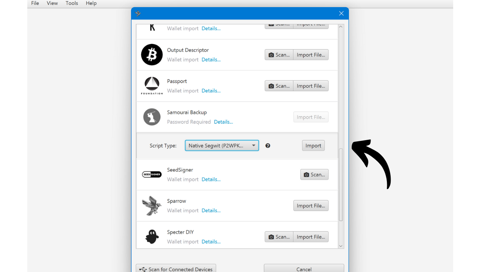

Nommez votre portefeuille, par exemple "Samourai Recovery", puis cliquez sur `Create Wallet`.

Sparrow vous demandera ensuite de choisir un mot de passe. Ce mot de passe protège uniquement l'accès à votre portefeuille sur ce PC et ne concerne pas la dérivation des clés de votre portefeuille. Assurez-vous de choisir un mot de passe solide, notez-le pour vous en souvenir, et cliquez sur `Set Password`.

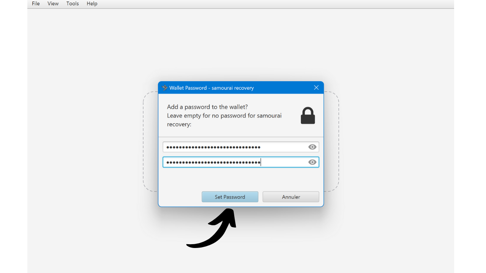

Sparrow va alors dériver les clés de votre portefeuille et rechercher les transactions correspondantes.

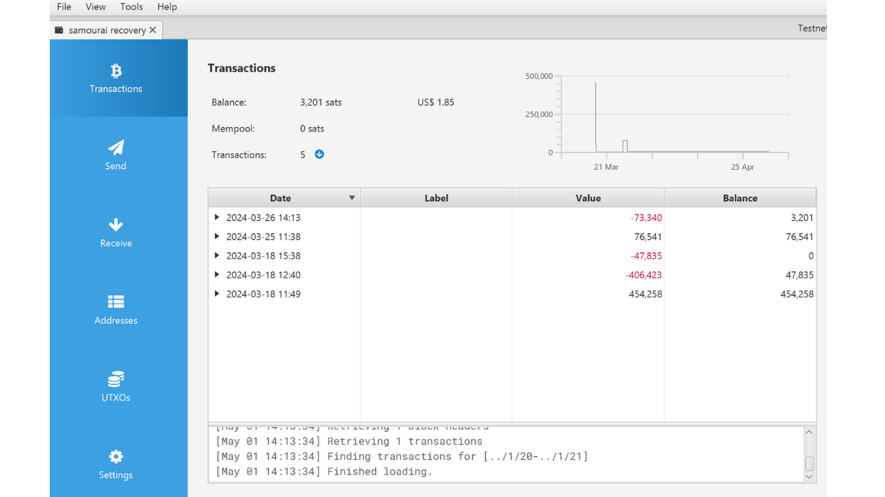

Pour l'instant, seul votre compte de dépôt est accessible. Si vous n'utilisiez Samourai que pour ce compte, vous devriez voir l'intégralité de vos fonds. Cependant, si vous utilisiez également Whirlpool, vous aurez besoin de dériver les comptes `premix`, `postmix` et `badbank`. Sur Sparrow, cliquez simplement sur l'onglet `Settings`, puis sur `Add Accounts...`.

Dans la fenêtre qui s'ouvre, sélectionnez `Whirlpool Accounts` dans la liste déroulante, puis cliquez sur `OK`.

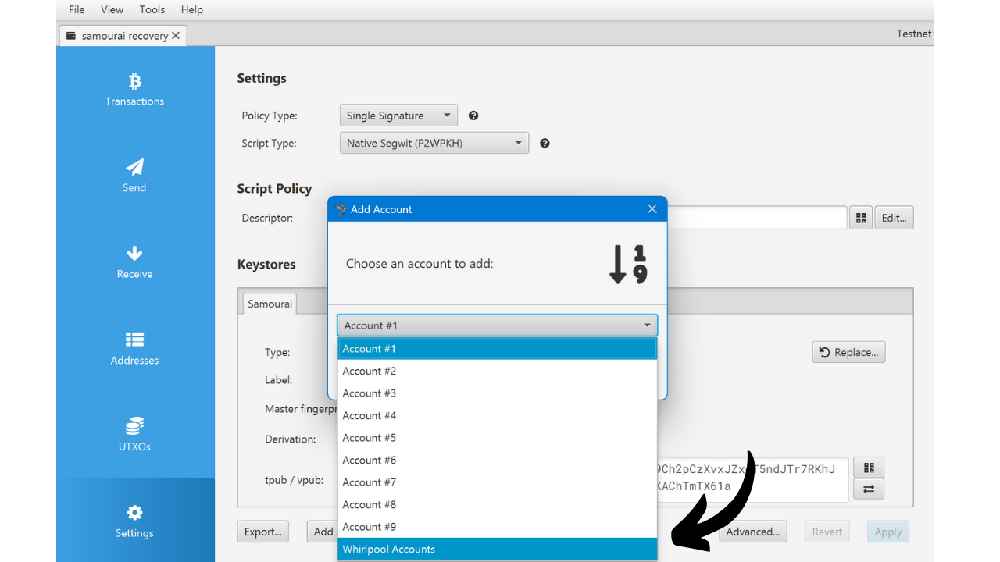

Vous verrez alors apparaître vos différents comptes Whirlpool et Sparrow va dériver les clés nécessaires pour utiliser les bitcoins associés.

Si vous utilisez un autre logiciel que Sparrow, comme Electrum, pour récupérer votre portefeuille Samourai, voici les index des comptes Whirlpool pour les récupérer manuellement :
- Dépôt : `m/84'/0'/0'`
- Bad Bank : `m/84'/0'/2147483644'`
- Premix : `m/84'/0'/2147483645'`
- Postmix: `m/84'/0'/2147483646'`

Vous avez maintenant accès à vos bitcoins sur Sparrow. Si vous avez besoin d'aide pour utiliser Sparrow Wallet, vous pouvez également consulter[ notre tutoriel dédié](https://planb.network/tutorials/wallet/sparrow).

Je vous recommande aussi d'importer manuellement les étiquettes que vous aviez associées à vos UTXO sur Samourai. Cela vous permettra de réaliser un contrôle efficace de vos pièces (coin control) sur Sparrow par la suite.

### Option 2 : Récupérer le portefeuille sur Sparrow avec la phrase mnémonique

Si vous ne souhaitez pas réaliser la récupération avec le fichier de sauvegarde, vous pouvez opter pour une méthode plus classique en utilisant simplement votre phrase de récupération de 12 mots et votre passphrase. Cette seconde option est souvent plus simple.

Pour commencer, assurez-vous d'avoir votre phrase de récupération et votre passphrase à portée de main. Ensuite, ouvrez le logiciel Sparrow Wallet, cliquez sur l'onglet `File` et sélectionnez `Import Wallet` pour commencer l'importation de votre portefeuille.

Choisissez `Mnemonic Words (BIP39)` et, dans la liste déroulante, cliquez sur `Use 12 Words`.

Saisissez les 12 mots de votre phrase de récupération dans le bon ordre.

Si Sparrow affiche un message `Invalid Checksum`, cela indique que la somme de contrôle de la phrase de récupération n'est pas valide, ce qui signifie probablement que vous avez fait une erreur en saisissant les mots.

Si votre phrase est correcte, cochez la case `Use Passphrase?` et entrez votre passphrase dans le champ dédié. Enfin, si tout vous semble correct, cliquez sur le bouton `Discover Wallet`.

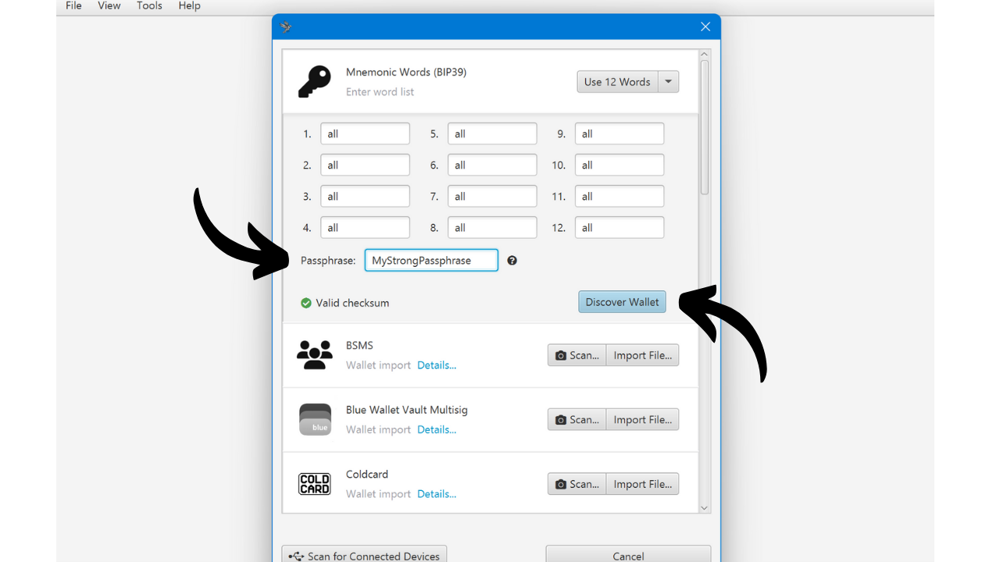

Nommez votre portefeuille, par exemple "Samourai Recovery", puis cliquez sur `Create Wallet`.

Sparrow vous demandera ensuite de choisir un mot de passe. Ce mot de passe protège uniquement l'accès à votre portefeuille sur ce PC et ne concerne pas la dérivation des clés de votre portefeuille. Assurez-vous de choisir un mot de passe solide, notez-le pour vous en souvenir, et cliquez sur `Set Password`.

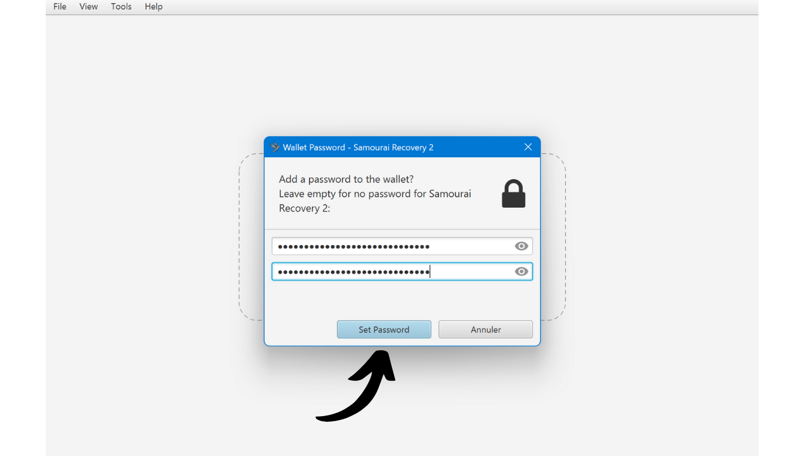

Sparrow va alors dériver les clés de votre portefeuille et rechercher les transactions correspondantes.

Si à ce stade, votre portefeuille n’apparaît pas, il est possible que vous ayez commis une erreur lors de la saisie de la passphrase ou de la phrase de récupération. Vous pouvez consulter la section dédiée à la résolution des problèmes pour plus d'aide.

Pour l'instant, seul votre compte de dépôt est accessible. Si vous n'utilisiez Samourai que pour ce compte, vous devriez voir l'intégralité de vos fonds. Cependant, si vous utilisiez également Whirlpool, vous aurez besoin de dériver les comptes `premix`, `postmix` et `badbank`. Sur Sparrow, cliquez simplement sur l'onglet `Settings`, puis sur `Add Accounts...`.

Dans la fenêtre qui s'ouvre, sélectionnez `Whirlpool Accounts` dans la liste déroulante, puis cliquez sur `OK`.

Vous verrez alors apparaître vos différents comptes Whirlpool et Sparrow va dériver les clés nécessaires pour utiliser les bitcoins associés.

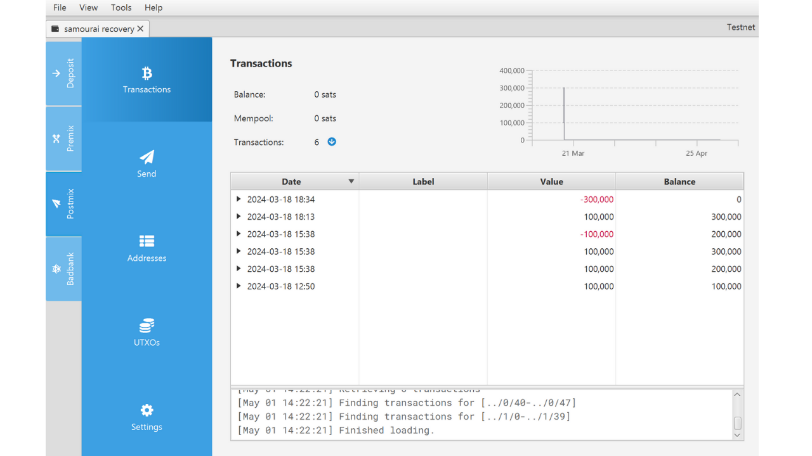

Si vous utilisez un autre logiciel que Sparrow, comme Electrum, pour récupérer votre portefeuille Samourai, voici les index des comptes Whirlpool pour les récupérer manuellement :
- Dépôt : `m/84'/0'/0'`
- Bad Bank : `m/84'/0'/2147483644'`
- Premix : `m/84'/0'/2147483645'`
- Postmix: `m/84'/0'/2147483646'`

Vous avez maintenant accès à vos bitcoins sur Sparrow. Si vous avez besoin d'aide pour utiliser Sparrow Wallet, vous pouvez également consulter[ notre tutoriel dédié](https://planb.network/tutorials/wallet/sparrow).

Je vous recommande aussi d'importer manuellement les étiquettes que vous aviez associées à vos UTXO sur Samourai. Cela vous permettra de réaliser un contrôle efficace de vos pièces (coin control) sur Sparrow par la suite.

### Quels sont les problèmes fréquemment rencontrés ?

Après avoir aidé plusieurs personnes ces derniers jours, je pense avoir rencontré la plupart des problèmes qui peuvent empêcher la récupération de votre portefeuille. Si vous ne parvenez toujours pas à accéder à votre portefeuille malgré les tutoriels précédents, voici quelques recommandations supplémentaires.

Tout d'abord, pour que la récupération fonctionne, il faut absolument que la phrase de récupération soit correcte. Si vous ne parvenez pas à retrouver votre phrase de 12 mots, vous pouvez utiliser l'option 1 pour récupérer depuis le fichier de sauvegarde de Samourai. Vous pouvez aussi accéder à votre phrase de récupération directement dans Samourai Wallet en naviguant dans `Paramètres`, puis `Portefeuille`, et enfin en sélectionnant `Afficher la phrase de récupération à 12 mots`.

Ensuite, une erreur de saisie dans votre passphrase pendant la récupération entraînera des clés dérivées incorrectes, ce qui empêchera la récupération de votre portefeuille sur Sparrow. **Il faut que la passphrase soit parfaitement exacte !**

Pour résoudre cela, je vous conseille d'abord de vérifier dans l'application Samourai la validité de votre passphrase comme décrit dans la section "_Vérifier la passphrase_" de cet article :
1. **Validation dans Samourai :** Si Samourai confirme que la passphrase est correcte, essayez de nouveau la récupération depuis le début, en faisant attention à bien renseigner la passphrase dans Sparrow sans erreur ;
2. **Erreur de passphrase :** Si Samourai indique que la passphrase est incorrecte, il est inutile de continuer les tentatives sur Sparrow. Tant que la bonne passphrase n'est pas retrouvée, la récupération de votre portefeuille est impossible. Si vous avez perdu votre passphrase définitivement, conservez bien votre application Samourai. Il ne vous reste plus qu'à espérer que les serveurs soient relancés afin de pouvoir effectuer des dépenses directement depuis l'application sans nécessiter de récupération. **Ne tentez pas de connecter un Dojo dans ce cas**, car cela impliquerait de réinitialiser votre portefeuille sur Samourai, ce qui requiert l'accès à la passphrase.

Parmi les autres erreurs rencontrées, nombreuses sont celles liées à la configuration réseau sur Sparrow.

Assurez-vous d'abord que Sparrow est bien configuré en mode `mainnet` plutôt qu'en mode `testnet`. En effet, si Sparrow recherche vos transactions sur le Testnet, il ne trouvera rien car votre portefeuille est sur le Mainnet. Le Testnet est une version alternative de Bitcoin, utilisée uniquement pour les tests et le développement, et fonctionne sur un réseau distinct du réseau principal (mainnet), avec ses propres blocs et transactions. Pour vérifier sur quel réseau vous êtes, cliquez sur l'onglet `Tools`, puis sur `Restart In`. Si l'option `Mainnet` est affichée, alors vous n'êtes pas sur le réseau principal. Sélectionnez-la pour redémarrer Sparrow sur le Mainnet, puis recommencez votre processus de récupération.

Certains ont aussi rencontré des difficultés pour connecter Sparrow à leur nœud. En bas à droite de Sparrow, un switch coloré indique si votre logiciel est correctement connecté à un nœud Bitcoin. Pour retrouver vos transactions Samourai, il faut absolument que le logiciel soit bien connecté. Vérifiez que le switch est activé, comme sur mon image ci-dessous (jaune pour un nœud public, vert pour Bitcoin Core et bleu pour un serveur Electrum).

Si le switch n'est pas activé, cliquez dessus pour réactiver la connexion.

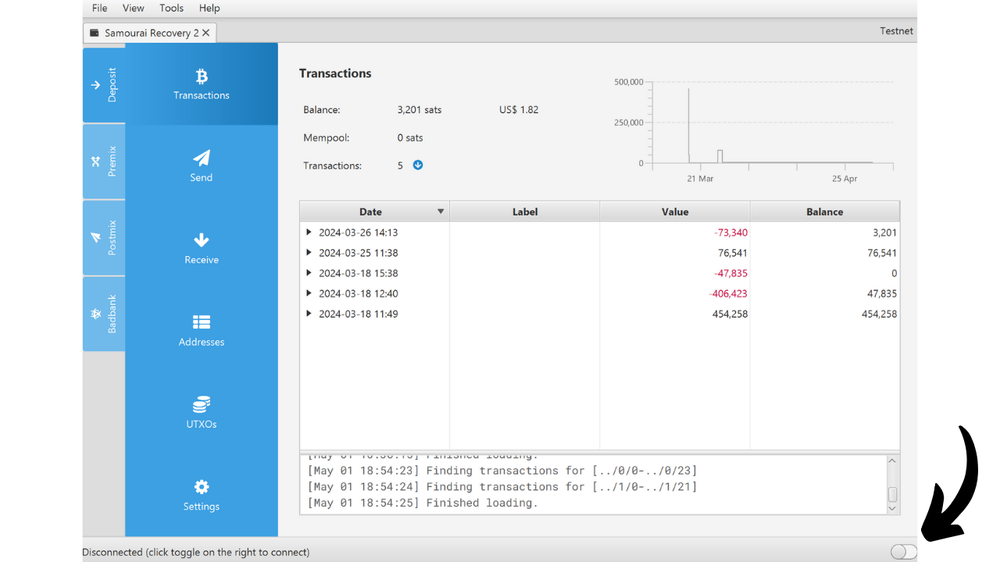

Si le problème persiste, voici quelques solutions possibles :
- Si vous essayez de vous connecter à votre serveur Electrum (bleu) ou à votre Bitcoin Core (vert) et que Sparrow n'arrive pas à se connecter, vérifiez les informations de connexion sous `File > Preferences... > Server` ;

- Si le problème de connexion persiste, cela pourrait être dû à une synchronisation incomplète de votre nœud. Assurez-vous que votre nœud et votre indexeur sont synchronisés à 100%. Si nécessaire en dernier recourt, déconnectez votre nœud de Sparrow et connectez-vous à un nœud public ;
- Si vous étiez déjà connecté à un nœud public et que la connexion échoue, tentez de changer de nœud en en sélectionnant un autre dans la liste déroulante.

Si vous avez réussi à récupérer votre portefeuille mais que celui-ci semble incomplet, il est possible qu'il y ait un problème lié à la dérivation.

Un problème pourrait subvenir si vous avez utilisé votre compte de dépôt Samourai avec un type de script différent du `P2WPKH`. Par défaut, Samourai utilise ce type de script, mais si vous l'avez modifié manuellement, vous devez également ajuster cela lors de la récupération sur Sparrow.

Pour dériver les branches pour d'autres types de script, vous devez répéter le processus de récupération pour chaque type de script utilisé. Pour cela, allez dans `File > New Wallet` sur Sparrow, sélectionnez un autre type de script dans la liste déroulante, cliquez sur `New or Imported Software Wallet`, et suivez les mêmes étapes que dans le tutoriel initial.

Un autre problème de dérivation que j'ai rencontré est lié à la valeur du Gap Limit. Cette valeur indique à Sparrow après combien d'adresses vides il doit arrêter de dériver de nouvelles adresses. Si après la récupération, vous observez que certaines transactions sont manquantes, cela peut être dû à un Gap Limit trop bas. Pour résoudre ce problème, placez-vous sur le compte qui pose problème, par exemple, le compte postmix (si plusieurs comptes sont concernés, répétez cette opération pour chacun).

Cliquez sur l'onglet `Settings` puis sur le bouton `Advanced...`.

Augmentez progressivement la valeur du Gap Limit, par exemple, je l'ai mise à `400` ici. Puis, cliquez sur le bouton `Close`. 

Cliquez sur `Apply` pour finaliser. Sparrow va alors dériver un plus grand nombre d'adresses et rechercher des fonds sur celles-ci, ce qui devrait permettre de retrouver l'intégralité de vos transactions.

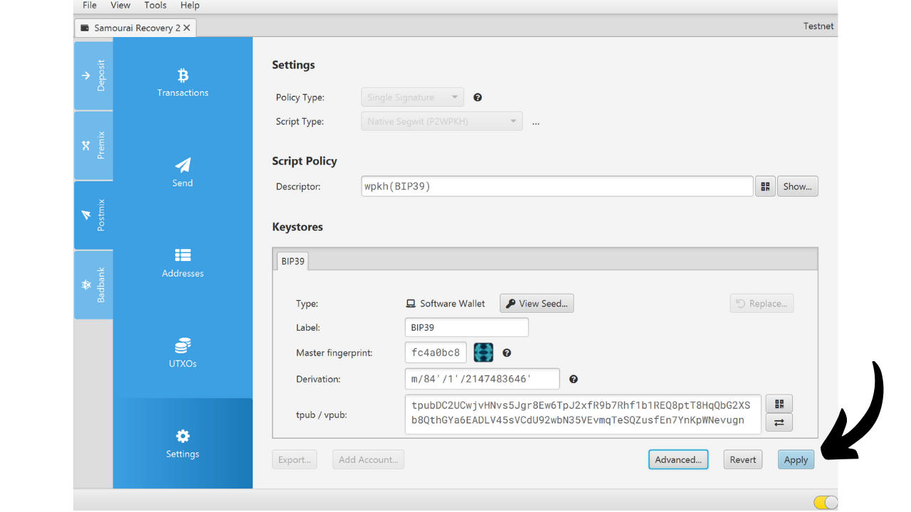

Voilà pour les différents problème de récupération que j'ai pu rencontrer durant les derniers jours. Si après avoir testé toutes ces solutions, vous êtes encore en difficulté, je vous invite à rejoindre [le Discord de Découvre Bitcoin](https://discord.gg/xKKm29XGBb) pour demander de l'aide. Je fréquente régulièrement ce Discord et je serai ravi de vous aider si je possède la solution. D'autres bitcoiners pourront également partager leurs expériences et vous apporter leur aide.

Une fois la récupération terminée, vous avez dorénavant accès à vos bitcoins. C'est une bonne chose, mais ce n'est pas forcément suffisant. En effet, la saisie des serveurs soulève de nouveaux risques potentiels pour votre confidentialité. Dans la section suivante, nous examinons en détail ces risques et exposons les précautions à prendre pour protéger votre vie privée.

## Quelles sont les conséquences pour la confidentialité de vos transactions ?

### En tant qu'utilisateur de Samourai sans Dojo

Si vous utilisiez Samourai Wallet sans avoir connecté votre propre Dojo, vos xpubs devaient être communiqués aux serveurs de Samourai pour que l'application fonctionne. Avec la saisie de ces serveurs, il est possible que les autorités aient désormais accès à ces xpubs.

Ce scénario reste hypothétique. Nous ignorons si ces xpubs étaient enregistrées, si un stockage potentiel a été détruit, si les autorités les ont récupérées, et si elles prévoient de les utiliser pour des analyses de chaîne. Cependant, dans une telle situation, il est prudent d'envisager le pire cas, où les autorités disposeraient des xpubs des utilisateurs qui ne connectaient pas leur propre Dojo.

Pour rappel, une xpub est une chaîne de caractères qui contient tous les éléments nécessaires à la génération de clés publiques enfants (clé publique + code de chaîne). Elle est utilisée dans les portefeuilles déterministes hiérarchiques pour générer des adresses de réception et observer les transactions d'un compte sans exposer les clés privées associées. Cela permet par exemple de créer un portefeuille en mode "watch-only". Cependant, la divulgation des xpubs peut compromettre la confidentialité de l'utilisateur, car elles permettent à des tiers de suivre les transactions et de visualiser les soldes des comptes associés.

Quiconque connaît vos xpubs peut ainsi voir toutes les adresses de réception de votre portefeuille, celles utilisées dans le passé et celles qui seront générées à l'avenir.

Pour les utilisateurs sans Dojo, une potentielle fuite de vos xpubs a deux conséquences majeures :
- Les coinjoins que vous avez réalisés sont rendus inefficaces du point de vue de la confidentialité pour toute personne connaissant vos xpubs, vos pièces perdent ainsi tout anonset ;
- Cette personne peut également suivre toutes les adresses de réception de votre Samourai Wallet.

Il est donc important d'envisager le pire scénario et de vous séparer de ce portefeuille, potentiellement devenu compromis en termes de confidentialité. Pour ce faire, créez un nouveau portefeuille à partir de zéro avec un autre logiciel, comme Sparrow Wallet. Après avoir vérifié la validité de vos sauvegardes, transférez-y tous vos fonds. Bien que cette opération ne rompe pas le lien de traçabilité de vos pièces, elle empêchera les autorités de connaître avec certitude les adresses de votre nouveau portefeuille.

Lors de cette opération de transfert, je vous recommande d'éviter la consolidation de vos pièces. Si nous supposons que vos xpubs sont compromises, la consolidation n'aura aucune incidence du point de vue de la personne ayant accès à ces xpubs, puisque votre confidentialité est déjà compromise avec elle. Cependant, je vous conseille de ne pas trop consolider vos pièces principalement pour protéger votre confidentialité vis-à-vis des autres personnes. Dans le pire des cas, seules les autorités pourraient avoir accès à vos xpubs, mais le reste du monde n'en a pas connaissance. Ainsi, du point de vue des autres, consolider vos pièces pourrait significativement nuire à votre confidentialité à cause de la CIOH (*Common Input Ownership Heuristic*).

Enfin, pour briser définitivement le suivi, envisagez également de réaliser des coinjoins depuis ce nouveau portefeuille.

**Attention :** Simplement récupérer votre portefeuille Samourai sur Sparrow Wallet ne suffit pas. Il est nécessaire de créer un tout nouveau portefeuille avec une nouvelle phrase de récupération si vous voulez éviter d'utiliser les xpubs qui ont potentiellement fuité. Si vous importez votre seed existante dans Sparrow, vous changez seulement de logiciel de gestion, mais le portefeuille reste le même.

### En tant qu'utilisateur de Sparrow ou de Samourai avec Dojo

Si votre portefeuille est uniquement géré sur Sparrow Wallet, vos xpubs ne peuvent pas avoir fuité, que vous utilisiez un nœud public ou votre propre nœud Bitcoin. De même, si vous utilisez l'application Samourai et que vous avez toujours connecté cette application à votre propre Dojo depuis la création de votre portefeuille, vos xpubs sont également sécurisées.

Toutefois, si vous avez utilisé le même portefeuille durant une période **sans votre propre Dojo** puis avec votre propre Dojo, il est possible que les serveurs de Samourai aient eu accès à vos xpubs, et donc les autorités pourraient les connaître. Si vous êtes dans cette situation spécifique, je vous conseille de suivre les recommandations de la partie précédente et de considérer vos xpubs comme compromises.

Pour ceux qui ont toujours utilisé Sparrow ou Samourai avec leur propre Dojo, le principal risque est que l'anonset de vos pièces soit potentiellement réduit. Supposons, dans le pire des cas, que tous les utilisateurs sans Dojo aient leurs xpubs entre les mains des autorités, alors le parcours de leurs pièces à travers les cycles de coinjoins pourrait être tracé par ces autorités.

Pour illustrer cela, prenons un exemple concret. Imaginez que vous ayez participé à un premier cycle de coinjoin, suivi par deux cycles supplémentaires de coinjoins descendants. Si les xpubs des utilisateurs sans Dojo n'ont pas fuité, alors l'anonset prospectif de votre pièce serait de 13.

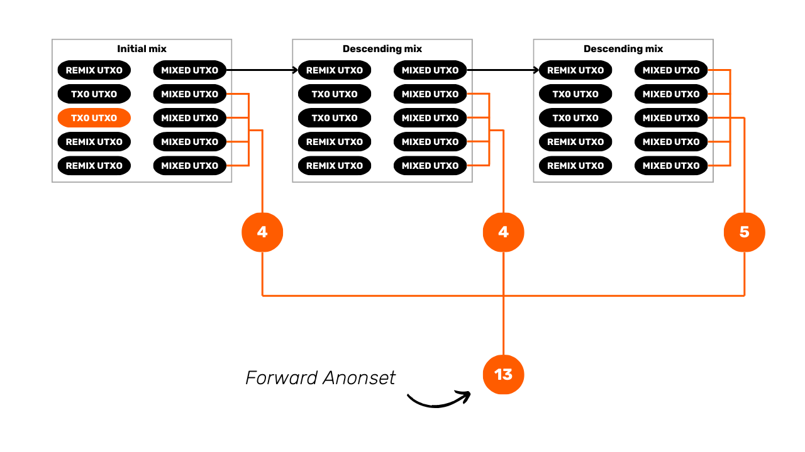

Cependant, si l'on envisage que les xpubs ont fuité et que vous avez croisé un utilisateur sans dojo lors du coinjoin initial, puis deux durant le premier coinjoin descendant, alors votre anonset prospectif ne serait plus que de 10 au lieu de 13 de point de vue de l'autorité.

Cette potentielle diminution des anonsets est complexe à quantifier car elle dépend de nombreux facteurs, et chaque pièce est affectée différemment. Par exemple, un utilisateur sans Dojo croisé dans les premiers cycles impacte beaucoup plus l'anonset prospectif qu'un croisé dans les derniers cycles. Pour vous donner une idée de la situation, qui reste hypothétique, les dernières statistiques fournies par Samourai indiquaient qu'entre 85% et 90% des pièces engagées dans des coinjoins provenaient d'utilisateurs avec Dojo, Sparrow ou Bitcoin Keeper, c'est-à-dire d'utilisateurs qui, même dans le pire des cas, n'auraient pas vu leurs xpubs fuiter.

Bien que ces chiffres soient difficiles à vérifier, ils me semblent cohérents pour deux raisons :
- Sparrow Wallet est largement utilisé ;
- La plupart des logiciels de node-in-box offrent des implémentations de Dojo, et ces logiciels grand public comme Umbrel sont très populaires de nos jours.

Ainsi, plusieurs aspects sont à considérer. Si la confidentialité de vos pièces vis-à-vis des autorités est extrêmement importante pour vous, il serait prudent de prévoir le pire scénario, et il est difficile de garantir à 100% que vos cycles de coinjoins Whirlpool ne puissent pas être tracés à cause de la potentielle fuite des xpubs des utilisateurs sans Dojo. Bien que cette hypothèse soit hautement improbable, elle n'est pas impossible.

En revanche, si la confidentialité de vos pièces vis-à-vis de l'autorité potentiellement en possession de ces xpubs n'est pas cruciale pour vous, alors la situation peut être considérée différemment.

Je précise "vis-à-vis de l'autorité", car il est important de rappeler que seule l'autorité ayant saisi les serveurs est potentiellement en connaissance de ces xpubs. Si votre but en utilisant le coinjoin était d'empêcher que votre boulanger puisse suivre vos fonds, alors il n'est pas mieux informé qu'avant la saisie des serveurs.

Enfin, il est essentiel de prendre en compte l'anonset initial de votre pièce, avant la saisie des serveurs. Prenons l'exemple d'une pièce qui avait atteint un anonset de 40 000 ; la baisse potentielle de cet anonset est probablement négligeable. En effet, avec un anonset de base déjà très élevé, il est peu probable que la présence de quelques utilisateurs sans Dojo puisse radicalement changer la situation. Cependant, si votre pièce avait un anonset de 40, alors cette potentielle fuite pourrait gravement affecter vos anonsets et permettre potentiellement un traçage.

Avec l'outil WST désormais hors service suite à la fermeture de OXT.me, vous ne pouvez qu'estimer ces anonsets. Pour l'anonset rétrospectif, il n'y a pas trop de soucis à se faire puisque le modèle de Whirlpool assure que celui-ci est très élevé dès le premier coinjoin, grâce à l'héritage de vos pairs. Le seul cas où cela pourrait poser problème est si votre pièce n'a pas été remixée depuis plusieurs années et qu'elle a été mixée au début du lancement d'une pool. Concernant l'anonset prospectif, vous pouvez examiner la durée pendant laquelle votre pièce a été disponible pour des coinjoins. Si cela fait plusieurs mois, alors elle dispose probablement d'un anonset prospectif extrêmement élevé. En revanche, si elle a été ajoutée à une pool juste quelques heures avant la saisie des serveurs, alors son anonset prospectif est probablement très bas.

[**-> En savoir plus sur les anonsets et leur méthode de calcul.**](https://planb.network/tutorials/privacy/wst-anonsets)

Un autre aspect à considérer est l'impact des consolidations sur les anonsets des pièces qui ont été mixées. Étant donné que les comptes Whirlpool ne sont plus accessibles via l'application Samourai, il est probable que de nombreux utilisateurs aient transféré leur portefeuille sur d'autres logiciels et tenté de retirer leurs fonds de Whirlpool. En particulier, le week-end dernier, lorsque les frais de transaction sur le réseau Bitcoin étaient relativement élevés, il y avait une forte incitation, tant technique qu'économique, à consolider les pièces post-mix. Cela signifie qu'il est probable que de nombreux utilisateurs aient effectué d'importantes consolidations.

Le problème avec ces consolidations de post-mix est qu'elles réduisent toujours les anonsets, non seulement pour l'utilisateur qui les réalise, mais aussi pour les utilisateurs qu'il a rencontrés lors de ses cycles de coinjoin. Bien que je n'aie pas pu vérifier ni quantifier ce phénomène précisément, les incitations économiques liées aux frais de transaction à ce moment-là peuvent nous laisser supposer que les anonsets sont potentiellement moins élevés.

### En tant qu'utilisateur de Sentinel

Le fonctionnement en réseau de l'application de portefeuille watch-only Sentinel est similaire à celui de Samourai. Pour accéder aux informations de votre portefeuille, l'application doit transmettre les xpubs, clés publiques et adresses que vous avez fournies à un Dojo. Si vous avez toujours utilisé votre propre Dojo, il n'y a aucun problème et vous pouvez continuer à utiliser l'application sans souci. Cependant, si vous dépendiez des serveurs de Samourai pour votre Sentinel, il est possible que vos xpubs aient été exposées. Dans ce cas, il est conseillé de suivre le même processus de changement de portefeuille que celui recommandé pour Samourai Wallet lorsque connecté aux serveurs de Samourai.

Dans le cas improbable où vous utilisiez votre Dojo avec Samourai mais pas avec Sentinel, il serait plus prudent de considérer que vos xpubs sont compromises.

Je vous remercie d'avoir lu cet article jusqu'à la fin. Si vous pensez qu'il manque des informations ou si vous avez des suggestions, n'hésitez pas à me contacter pour m'en faire part. De plus, si vous avez besoin d'une aide supplémentaire pour récupérer votre Samourai Wallet malgré ce tutoriel, je vous invite à rejoindre [le Discord de Découvre Bitcoin](https://discord.gg/xKKm29XGBb) pour demander de l'aide. Je fréquente régulièrement ce Discord et je serai ravi de vous aider si je possède la solution. D'autres bitcoiners pourront également partager leurs expériences et vous apporter leur aide.